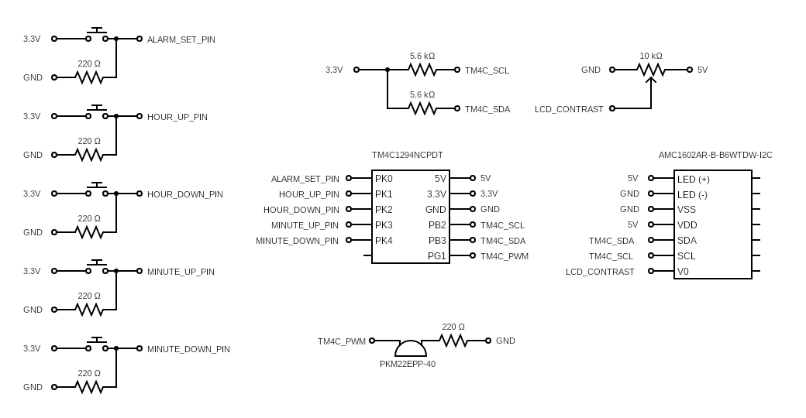

# Alarm Clock

## Functionality

This is a configurable PST alarm clock with simple functionality. There are 
five push buttons that are usable in Select Mode. Four buttons are used for 
each of increasing the hour, decreasing the hour, increasing the minute, and 
decreasing the minute. The final button is for toggling between Select Mode 
and Alarm Mode. Once in Alarm Mode, the buzzer will sound once the current 
time displayed on the top half of the LCD display equals the set alarm time. 
The sound is then turned off by again pressing the mode toggle button, at 
which point another alarm may be set.  

## Design

### Electronic Components

#### Microcontroller

This alarm clock uses a Texas Instruments TM4C1294NCPDT microcontroller. This 
microcontroller was chosen for its ethernet capabilities. The provided 
TivaWare drivers for programming the TM4C129 are used extensively in this 
project.  

#### LCD

The AMC1602AR-B-B6WTDW-I2C LCD is used for this project. It is a 16x2 display 
that has a builtin AC780S I2C controller. This allows for relatively 
straightforward communication with the I2C peripheral on the TM4C129.  

#### Piezoelectronic Buzzer

For the alarm sound, the PK2M22EPP-40 is used. It accepts a square wave as 
input, with the frequency of the wave determining the volume of the buzzer 
sound. This is controllable via the Pulse Width Modulation peripheral on the 
TM4C129.  

#### Ethernet Cable

Since the project uses the ethernet controller on the TM4C129 to obtain the 
time, an ethernet cable is required to hook up the TM4C129 to the internet.  

#### Other Components

Aside from these larger electronic components, the alarm clock also uses six 
220 Ohm resistors, two 5.6 kOhm resistors for the I2C pullup resistors, one 10 
kOhm potentiometer for the LCD contrast, five push button switches for setting 
the alarm, several wires, and breadboards.

### Outside Software/Libraries

The alarm clock also makes use of some third party software, including lwIP 
and FreeRTOS.  

#### LwIP

LwIP (lightweight IP) is an implementation of the TCP/IP stack that is 
suitable for use with microcontrollers. Texas Instruments provides software 
for interfacing with lwIP 1.4.1. However, lwIP 1.4.1 does not include an http 
client, which is necessary for this project. Therefore, a modified version of 
lwIP is used: [lwIP 1.4.1-http_client](https://github.com/zombie782/lwip-1.4.1-http_client). This version essentially merges the http 
client from lwIP 2.2.0 with lwIP 1.4.1, so that ultimately there is http 
client functionality on the TM4C129.  

#### FreeRTOS

FreeRTOS is a real time operating system that is designed for use with 
microcontrollers. Its main purpose in this project is to divide the software 
into seperate tasks that can be controlled with kernel functions. Each task 
will be described in more detail.  

### Tasks

#### LwIP Task

The lwIP task is adapted from the enet_io example from Texas Instruments. It 
initializes the TCP/IP stack with DHCP to give the microcontroller an IPv4 
address, as well as handles the on-board ethernet controller during http 
requests.  

#### Time Task

The time task is responsible for making sure the microcontroller has 
approximately the correct time at any given time. This is achieved by sending 
an http request to a Google IP address every time interval, which is currently 
set to 500 ms. The GMT time is obtained from the http response header from 
Google. The time task then converts this to PST, and if the time changed, 
updates the global time variable and gives control to the LCD task. Finally, 
if the time changes, the alarm is set, and the new time is equal to the alarm 
time, the time task gives control to the alarm task.  

#### LCD Task

The LCD task updates the LCD display when necessary. This is whenever the time 
changes, or any of the push buttons are pressed. These are the five buttons 
described in the functionality section. These are read by the on-board GPIO. 
The GPIO handler for Port K, which is the port that all of the push buttons 
are connected to, then assigns the button state variable an appropriate value 
based on which button was pressed. Button debouncing was necessary to 
implement for the handler because without it, the handler would read multiple 
button presses when it was only pressed once. Once a button state is given, 
the LCD task then performs the appropriate change to user time variable or the 
alarm set variable and updates the LCD display. This is done via I2C. The 
on-board I2C peripheral is used to communicate with the I2C controller on the 
LCD display.  

#### Alarm Task

The alarm task simply sounds the buzzer. This task is given the highest 
priority among the tasks, but is immediately suspended. This task is only 
executed when the time task deems that the current time is equal to the set 
alarm time. The only way to exit the alarm task is to press the mode toggle 
button to switch it back to Select Mode. The alarm is sounded by the on-board 
Pulse Width Modulation peripheral. This generates the necessary square wave 
that is required for the input into the buzzer. It is currently set to send a 
1kHz frequency square wave out of Port G, Pin 1.  

### Power and Memory Considerations

#### Power

The system clock was originally run at 120MHz, but the same functionality can 
be achieved by running it at only 10MHz, so that is what was chosen for the 
system clock frequency, which should save significant power consumption over 
120MHz.  

#### Memory

Stack sizes for tasks were also significantly reduced for each task at the end 
of development. Originally, 1000 words were used for each task, but it was 
found that the same functionality can be achieved by using only 250 words for 
the time task, 100 words for the LCD task, and 50 words for the alarm task.  

### Circuit Diagram

  

## Demo Video

[Demo Video](https://youtu.be/dp4kvePA2nc)

## Limitations/Potential Next Steps

While this project was a success, there are a few potential drawbacks to the 
current design.  

### Time Zones

This alarm clock only works in PST. It would be trivial to modify the software 
to use a different time zone, but adding a user interface way to switch time 
zones would make the deisgn more appealing to more people.  

### Adjusting the Minute

Currently, to set the alarm to 30 minutes past an hour, the user must press 
one of the minute buttons 30 times. Perhaps adding a feature that allows a 
faster increment when holding down the button would improve the project.  

### Behavior when Unplugging Ethernet

If the ethernet cable is unplugged, the current time simply freezes and the 
alarm clock is unusable until it is plugged in again. An ambitious upgrade 
would be to use an internal clock to update the current time while the 
ethernet cable is unplugged.  

### Volume Control

Perhaps adding a way for the user to adjust the volume of the buzzer, 
potentially via a potentiometer, would be a nice quality-of-life upgrade.  